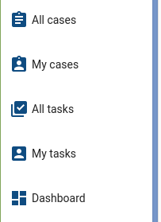
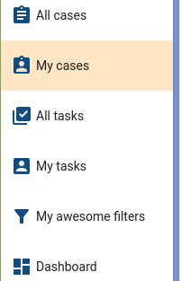
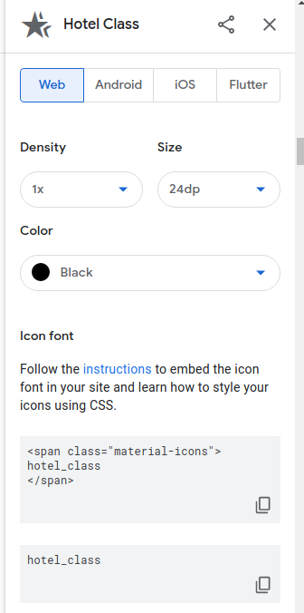
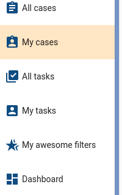

# Customisable group navigation

## User guide

This guide is aimed at application users that wish to know, how to configure the navigation menu of their groups.

### Overview

Owner of a group can configure the navigation menu for the members of the group.

The application developers can make some menu items permanent, and they can designate a position in the navigation menu,
where configurable entries will be inserted.



In this example, the first four entries are configurable entries and the last is fixed by the app developer.

The configurable group navigation can contain default entries specified by the application developer (as is the case in
the above example), but they can be removed or modified by the group owner.


The group process contains a task - “Configure menu“, that is visible to the group owner and is used to configure the
navigation menu or perform import/export of menu configurations.


The first section can be used to add new entries to the navigation menu.


The following sections each represent a single navigation menu entry and can be used to modify, rearrange or remove
them.

### Adding new entries

The “Select filter“ field can be used to search filters available to the group owner.


The options displayed contain the entered text as substring.


When an option is selected a preview of the filter is displayed. We can append the selected filter to the menu by
pressing the “Add to menu“ button. The filter entry will be created and added at the bottom of the list, the input field
will be cleared and the filter preview will be hidden.

The name of the new entry will be set to the name of the filter and the entry icon will also be set to the filter icon.
The navigation will not reload automatically when a new entry is added, so you have to reload the website in order to
see the new navigation entries.

The same filter can only be added to the menu once.

### Modifying navigation entries


The navigation entry displays its name, buttons that can be used to rearrange the entries, or to remove them, role
authorization management to enable or disable viewing the entry for specific roles, the icon configuration and the
filter preview. If the filter preview is empty it means the entry holds an empty filter.

The navigation entries can be rearranged by pressing the “Up“ and “Down“ buttons. They can be removed by pressing the
“Remove“ button.




Renaming the entry will change the name displayed in the menu. The navigation will not reload automatically when its
configuration changes, so you have to reload the website in order to see the changes.


The entry icon can be disabled by switching the toggle.






The icons can be changed by entering the identifier for the appropriate material design icon
from [this list](https://fonts.google.com/icons?selected=Material+Icons). A preview of the icon is displayed if the
entered text is a valid icon identifier. Once again, in order to see the changes affecting the menu configuration, you
have to reload the website.

#### Role view authorization management

The visibility of the navigation entries can be restricted only to certain roles.

Roles can restrict visibility in two ways:

* Only users that have the role will be able to see the entry - for example: all users with the "student" role should
  see the navigation entry for their homework
* Only users that DON'T have the role will be able to see the entry - for example: all users that are not "students"
  should see the navigation entry for the parent-teacher meetings

Allowed and banned roles are saved in separate lists. When adding new roles to these lists, you must first choose one of
your deployed nets (from all versions). Then you can select one or more roles available from the selected process
version.

* Button _“Allow view for roles“_ will add selected roles to the list of roles which are able to view the entry.
* Button _“Ban view for roles“_ will add selected roles to the list of roles which are NOT able to view the entry.


If the user wants to remove one or more roles from the list of allowed/banned roles, they can select them and click on _
“Remove from allowed / banned roles”_ button situated to the right of the list.


##### Special cases and specification

* Author cannot add the same roles from multiple versions of the same process.
* A role cannot be present in both lists (allowed, banned) at the same time.
* If the _Allowed roles_ list is empty, everybody will be able to view the entry unless one of their roles is present in
  the _Banned roles_ list.
* If a user has multiple roles and at least one of them is present in the _Banned roles_ list, they will not be able to
  view the entry.

## Import/Export of menu

### Overview

Every group Admin in the application has option to import/export menu configurations. After export, configurations
consisiting of menu entries with their respective filters are saved in an XML file that can be imported any other NAE
application.

<div style="text-align:center">


</div>

#### Export

User can create multiple menu configurations for export. To prepare a configuration for export, user may choose entries
he wishes to add to menu configuration from Multichoice field  **Available entries for export**, which contains all
entries present in current application menu.

<div style="text-align:center">


</div>

After selecting entries of which new menu configration will consist, user should specify unique menu name in field **Exported menu identifier** and then click **Add entries to export** button to add seleced menu configuration to export.
To update selection after some menu entry title has been changed or a menu entry has been removed, clicking button **Update entries** will refresh the selection.

<div style="text-align:center">


</div>

User can create any number and form of confgurations from existing entries in menu. To export configurations added to
export (Field **Menus to be exported**), user has to click button **Export menu**, which will upload downloadable XML
file with menu configurations and their filters to FileField **Exported menu file**. By clicking on this field, you will
download your menu configuration. If user wishes to remove configurations already prepared for exported, he will do by
clicking **Clear menu configurations** button.

<div style="text-align:center">


</div>

#### Import

To import a menu configuration, user has to upload a file to FileField **Import menu**. By clicking the **Import menu**
button, all menu configurations identified by their name will be imported. If there are any existing entries belonging
to menu with same menu identifier (name) as one the menu configurations being imported, all those entries will be
replaced by imported menu configuration identified by that menu identifier.

Results from import can be seen on the right side in the "Import results"text area.

<div style="text-align:center">


</div>

## Developer guide

This guide is aimed at developers that wish to know the implementation details of the configurable group navigation, so
that they may interact with or override its functionality.

### Overview

The configurable group navigation consists of 3 engine processes that interact with each other in order to create the
necessary configuration.

* **Group process** - contains the task that configures the menu
* **Filter process** - stores the saved filters
* **Preference filter item** - creates an M:N mapping between filters and groups and holds the information about the
  individual navigation entries

A new runner - `DefaultFiltersRunner` - has been introduced in order to create the instances of the default filters.
Whenever a new group instance is created, its navigation is configured in such a way that it contains the default
filters, with their case icons set as the entry icons and their names set as the entry names.

### Processes

#### Group process

The frontend gets its data regarding the group navigation from a task in the group process. This task must always be
available, otherwise the frontend won’t be able to get the necessary data and the navigation entries will not be
generated. The ID of this task must be `navigationMenuConfig` as this is the ID search for by the frontend. An `enum`

- `GroupNavigationConstants` - exists in the `application-engine` frontend library, that contains the identifiers of all
  group navigation fields referenced by the frontend application.

This task must contain a task ref with all the **preference filter item** process instances in order for the frontend to
parse the value correctly.

##### Menu import/export funcionality

Group process also contains actions for performing menu import and export. Functionality is explained in more detail in
section [Menu import/export](#menu-import/export)

#### Filter process

Consult the documentation of the filter process for more information about it.

The filter process contains an enumeration field with ID `i18n_filter_name`. This field can contain translations as its
value and this value is used to set the initial value of the navigation entry name. This way default translations of the
default configurable group navigation entries can be set.

#### Preference filter item process

Each instance of this process represents a navigation menu item in one group. This way if a referenced filter process
instance changes its filter all the menu items referencing it will automatically update themselves to reference the new
filter value. Furthermore, the same filter can be displayed in multiple groups under different names and with different
icons independent of each other.

Most of the data variables in this net must maintain their IDs, otherwise the frontend won’t be able to parse the data
contained within.

The navigation entry contains two fields that hold the title:

* an enumeration field `entry_name` - this field contains the I18n value with all the translations and is used to
  generate the text displayed in the navigation menu entry
* a text field `entry_default_name` - this field is displayed to the user and allows the editing of the entry name. Its
  set action changes the `entry_name` value to a new `I18nString` with the value of this field set as the default
  translation.

Currently, it is impossible for users of the application to set I18n navigation entry names. This feature will be
available in a future release, but in the meantime it can be accomplished either by overriding
the `preference_filter_item` process, or by setting the value with custom actions in some way.

##### Role authorizations, fields and formats

This process holds information about process roles which can or cannot view current menu entry. They are saved in a
MultichoiceMap fields `allowed_roles` and `banned_roles`.

Each of their entries has the following format:

* String **key** “`ROLE_IMPORT_ID:NET_IMPORT_ID`“ (Example: “`loan_officer:mortgage`”)
* I18nString **value** “`ROLE_NAME (NET_TITLE)`" (Example: “`Loan Officer (Mortgage )`“

Role authorization functionality is provided by `ConfigurableMenuService.java` class.

When user wants to add new roles to either list, he should select a process from EnumerationMap
field `processes_available`.

* This fields options are created during its GET event. Only those processes (and their _versions_) whose author is
  equal to currently logged user are added.
* Each entry has the following format:
    * String **key** “`NET_IMPORT_ID:MAJORVERSION-MINORVERSION-PATCH`“ (Example: “`mortgage:1-0-0`”)
        * Version string needs to be part of key in order to have unique keys for different versions of the same process
        * Dots in version string are replaced by _hyphens_ “-“ because Mongo doesn't allow dots in Map keys)
    * I18nString **value** “`NET_TITLE:VERSIONSTRING`“ (Example: “`Mortgage :1.0.0`“)

After the process is selected, MultichoiceMap field `roles_available` gets its options updated. Each entry represents a
role from selected process which has not been already added to `allowed_roles` or `banned_roles` (regardless of its
process version) and its format is following:

* String **key** “`ROLE_IMPORT_ID:NET_IMPORT_ID`“ (Example: “`loan_officer:mortgage`”)

* I18nString **value** “`ROLE_NAME"` (Example: “`Loan Officer`“)

### Default filters

The `DefaultFiltersRunner` creates instances of the default filter processes. These are set as navigation menu entries
of newly created groups.

The runner class contains utility methods that can be used to create default filter process instances in a slightly
friendlier way. The default filters must have different case titles, as these are used to determine if the filters were
already created - a filter with the same name as an existing filter (created by the system user) will not be created.

### Menu import/export

Most functionality of importing and exporting menu configurations exists in  ```MenuImportExportService.java``` class.

#### Preference filter item

Changes to existing datafields:

- ```entry_default_name```: on SET also updates ```new_title``` field of menu entry's filter case to new value.
- ```icon_name```: on SET updates also icon of entry's filter case.

New datafields:

- ```menu_identifier```: TextField used to identify menu configuration to which this menu entry belongs to. Value for
  group's default entries id _"defaultMenu"_.

#### Group process

By performing calls to  ```MenuImportExport.java ``` class methods, this process covers functionality for import and
export of menu configurations.

##### Export

New datafields:

- MutlichoiceMapField ```available_export_entries```:
  Holds all current menu entries used for export selection. It's entries are in following format:
  **Key**: preference filter item ```caseId```
  **Value**: ```entry_default_name``` field value
- TextField ```export_menu_name``` where user will create identifier of selected menu configuration.
- ButtonField ```update_available_entries_btn ```:
  Updates ```available_export_entries``` with latest entry names from entries currently present in menu.
- ButtonField ```add_to_export_btn``` which prepares new menu configuration for export from selected entries and
  identifier. by adding them to ```menus_for_export```.

- EnumerationMapField ```menus_for_export```:
  Holds menu configurations prepared for export. Field's entries are in following format:
  **Key**: preference filter item case Ids delimited by "**,**"
  **Value**: ```export_menu_name``` value

- ButtonField ```add_to_export_btn``` calls ```MenuImportExportService.exportMenu``` method, which
  from ```menus_for_export``` field creates new downloadable XML file holding all menu configurations with their
  filters. Values of ```menus_for_export``` are then cleared. XML file is also validated against XSD schema.

##### Import

After uploading exported XML file holding menu configurations, user may click on ```import_menu_btn``` to
call ```importMenu``` method from ```MenuImportExportService.java``` class. This method creates new menu entry and
filter cases. It's result (newly imported Preference filter item and filter case Ids) is stored
in ```imported_menu_ids``` field and import result is shown in the ```import_results``` textArea.

New datafields:

- TaskRef ```imported_menu_ids``` consisting of String array entries in following format:
  Menu entry ``` caseId```, it' filter ```caseId```, String boolean value determining if menu entry should display its
  icon. Values are delimited by "**,**". These values are used later in petriflow action in ```import_menu_btn``` SET
  action.

- Text area field ```import_results```: Shows import results. Result messages can be following:
  -- OK (Entry was succesfully imported with all of its role configurations)
  -- Role missing from latest version of its net with net ```import_id```
  -- Net missing for role with role ```import_id```
  -- Filter missing (In this case only the entry isn't imported and it is skipped)

### Frontend

#### Routing configuration

The configurable group navigation can work both with dynamic routing generated by the Netgrif library, and with static
routing declared by the developer. The configuration necessary to make it work differs slightly in these scenarios. The
aim of this section is to provide instructions for using both setups.

##### Auto-generated dynamic routing

A special view - `groupNavigation` - should be declared in `nae.json` that tells the application where in the navigation
tree should the configurable navigation entries be inserted. It can be located anywhere in the tree but must declare
a `route` for the entry. This route fragment will be used to generate the full path just as with any regular view.

```json
"group-navigation-outlet": {
"layout": {
"name": "groupNavigation"
},
"navigation": false,
"routing": {
"path": "group-nav"
}
}
```

Since this entry itself serves only as a marker for the dynamic navigation generation it should not have a navigation
entry on its own.

##### Custom routing

If the custom routing is used with the auto-generated dynamic navigation, then a `groupNavigation` view must be declared
in `nae.json`, same as in the previous section. This view will only be used to generate the navigation entry and the
routing link this entry redirects to - no routing will be configured.

Routing must then be configured with the following entry:

```js
{
    path: '<dynamic_nav_path>/:filterCaseId',
        component
:
    AbstractGroupNavigationComponentResolverComponent,
        canActivate
:
    [AuthenticationGuardService]
}
```

the `filterCaseId` path attribute is shown only for clarity. We recommend using its constant

- `GroupNavigationConstants.GROUP_NAVIGATION_ROUTER_PARAM` instead.

The mapped component can differ if the developer wishes to override the component resolution behavior. If overriding the
component resolution is the goal more information can be found in the following section.

The `AuthenticationGuardService` should be used to restrict access to the view, since it uses backend requests to get
the necessary navigation information and therefore requires the user to be authenticated.

#### Using non-dynamic views

If your application contains views that are not generated by the dynamic navigation, and you want to allow users to save
and re-use filters created in these views you must ensure certain properties of these views.

Dynamic views created from saved filters can load their entire filter history in order to restore a complete
reproduction of the saved filter. If the filter originates from a default filter process this restoration does not need
any help from the developer. If however the filter originates from a view with a filter that is only declared on the
frontend some help is required.

The `FilterRepository` service must contain the filters of each view that can serve as a filter origin. The ID of these
filters must match the `viewId` of these views, excluding the suffix that is automatically added by the tabbed view. If
this requirement is not met an error will be logged and an empty filter will be loaded instead, which may result in
incorrect results being displayed to the application users.

#### Overriding group navigation view components

The configurable group navigation can contain task or case filters as its entries.

By default, if a task filter entry is selected a simple task view with the selected filter will be displayed.

If a case filter entry is selected a tabbed case view with the selected filter will be displayed and clicking on case
panels will open new tabs with tabbed task views.

This behavior mimics the behavior of case and task views generated by our schematics.

The components used to display these views are taken from the components library, but can be overridden in your
application.

All navigation entries are mapped to a single component - the `GroupNavigationComponentResolverComponent`, this
component then resolves the appropriate view based on the navigation entry data.

The `NAE_GROUP_NAVIGATION_COMPONENT_RESOLVER_COMPONENT` injection token can be used to provide a different component to
serve as the resolver. Alternatively you can extend the `AbstractGroupNavigationComponentResolverComponent` and re-use
its functionality and only provide a different implementation of the `GroupNavigationComponentResolverService`.

The components used to display the navigation entry filters must be able to set their search categories, their allowed
nets and their filter from the entry task data.

Provider factory methods for this extraction are available in our libraries.

#### Category and Allowed nets inheritance

Filter data variables contain metadata that include both the allowed nets and the available search categories. These
data must be provided in order for the component to display the filter correctly.

When a filter is set as a menu item it transfers its allowed nets and enabled search categories to the view it defines.

Whether this behavior is active, or not depends on the metadata properties:

* `defaultSearchCategories` - if _true_ the filter will merge its categories with the default search categories of the
  appropriate type. The default search categories are injected using the `NAE_DEFAULT_CASE_SEARCH_CATEGORIES`
  and `NAE_DEFAULT_TASK_SEARCH_CATEGORIES` injection tokens.
* `inheritAllowedNets` - if _true_ the allowed nets set in the filter metadata will be merged with the allowed nets
  provided by the `BaseAllowedNetsService`.

Allowed nets and enabled search categories can therefore be determined for each of the default filters in the runner, or
for any other filter with actions. Alternatively inheritance can be used to provide the same behavior in all the views
without the need to duplicate the information in multiple filters.

The default engine implementation saves filters with both of these metadata options set to _true_. This behavior can be
overridden by changing the settings in the `NAE_SEARCH_COMPONENT_CONFIGURATION` injection token.